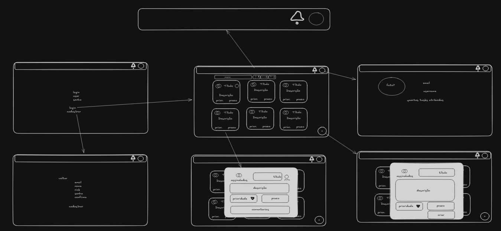
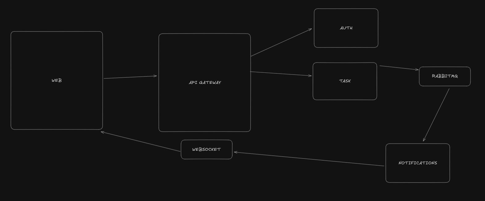

    De início, dei várias lidas na documentação do teste no GitHub para absorver bastante o que seria necessário, como implementar, regras de negócio e etc.
    Feito isso, parti para o excalidraw para "passar a limpo" as ideias, e poder visualizar melhor uns rabiscos de telas, e ter em mente quais componentes eu necessitaria, algumas ideias para arquitetar o back-end e outros.
    Depois do excalidraw, utilizei o dbdiagram para esquematizar um protótipo de como seria o banco de dados.
    Iniciando o projeto, utilizei o instalador do turborepo para criar o projeto, e logo após, criei a pasta web e já executei o instalador do TanStack Router. Com o app do front-end criado, já fiz o esboço de alguns componentes com o shadcn, como o header e o componente das tarefas.
    Uma tecnologia que não possuía muita experiência era o Nest, tendo em mente que utilizei apenas Express nos projetos pessoais e corporativos, e o Nest apenas em nível de curiosidade e estudos. O mesmo foi algo que demandou um certo tempo para eu me adaptar, sabendo que é mais complexo que o Express, com toda a questão do Clean Arch, DTOs etc.
    Segui a sugestão da documentação do vídeo para realizar a autenticação com o Nest e comunicação RMQ, e, por isso, precisei configurar o RabbitMQ como o broker dos microserviços. Após o back-end do task-services estar mais ou  menos esquematizado, com algumas DTOs, controllers, modules e services funcionando, retornei ao front-end para mudar um pouco os ares, fiz a tela de login e o roteamento para a tela inicial e a tela de perfil do usuário, renderizei as tarefas com dados mockados para fazer os ajustes necessários.
    Na tela de login fiz a validação do formulário com Zod + React Hook Form, bem como utilizei componentes shadcn.
    Finalizando (mais ou menos, sempre há coisas a se corrigir), voltei para a task de realizar a autenticação do usuário, no app auth-service, renomeei o controller, module e service do prefixo app para auth, criei a entity do user, instalei tudo que é necessário (bcrypt, passport etc.),
    Na continuação, fui garantir que todas as rotas básicas do CRUD estavam funcionando, fui corrigindo o que precisava ser corrigido, e fazendo as interfaces necessárias, como modal de confirmação de exclusão de tarefa etc. Contudo percebi que ainda não havia feito os hooks e a lógica do accessToken e RefreshToken, peguei para fazer após terminar o CRUD básico. Parei para ver o vídeo do PhillCode (https://www.youtube.com/watch?v=ccFVOXJnfmo) para entender melhor o assunto.

no docker compose, as portas das apis (sem ser do gateway) estão expostas

para gerar migration:
npx typeorm-ts-node-commonjs migration:generate ./src/migrations/migrationTwo -d ./src/config/typeorm.config.ts

para rodar migration:
npx typeorm-ts-node-commonjs migration:run -d ./src/config/typeorm.config.ts
